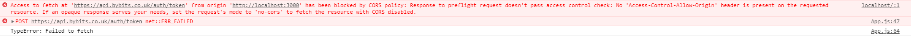

## By Miles Junior Developer Tech Challenge

This challenge was to create a simple web application with a login screen which takes a username and a password. Once authorised, it will navigate the user to another page which will display the policy details.

This is a first iteration of the app and I would welcome any feedback!

### How to run the app 

Once the project has been cloned locally, run `npm install` in the main directory to install the packages. Once packages have been installed, use `npm start` to start local development server for the web app.

### Technology used

For this challenge, I chose to build the application using React which is something that I'm more familiar with. React Router was used to handle the route from the root path `/` to `/policy-details` on successful sign in and to have a protected route such that a user cannot navigate to `/policy-details` without signing in first.

I decided to use React Hooks, ie `useState`, for handling the state. I considered using Redux but felt it was not necessary at this stage as the web application was not overly complicated and Redux will have a time cost to set up.

Bootstrap was used to make sure the web application was responsive and could display properly on mobile devices (more comments on this in the further improvements section).

### Comments on the API end points

#### Login API

This API was called to get the `access_token` which would then be used in the policy details API to retrieve the policy details. Any username and password combinations can be submitted and a response will be returned with the `access_token` which did not change. 

As such, for the purposes of this app, the only validation used in the form inputs was to make sure that both the username and password fields were not empty and then the log in button will be enabled and the information can be submitted.

There is no error handling as we do not expect an incorrect username or password combination and no errors should be returned from the response. Currently just outputs the `err` to the console. This decision was made mainly for simplicity but error handling must be included for a live environment (more comments in the further improvements section).

#### Policy details API

This API was called to get the policy details after successfully retrieving the `access_token`. The token gets passed in the `Authorization` header in the `GET` request and the policy details will be provided in the response.

From my observations, it would appear that a response will still be provided even if the `Authorization` header is not supplied in the `GET` request. I'm assuming this was intentional as it is a mock API.

#### Potential CORS error

There is occasionally an error with the Login API and Policy details API where the API call will generate an error message saying that the local test environment `http://localhost:3000` has been blocked by CORS policy.

**Error message**

From reading around online, my understanding is that this is an issue with the backend not liking the request I submitted from the local testing environment. I did try using a [proxy](https://cors-anywhere.herokuapp.com/) to overcome the problem but it would then generate intermittent `HTTP internal server error 500` messages.

As the error only occurs intermittently on both API endpoints, I have assumed for the purposes of this challenge that a full fix is not required. 

When reviewing the web app, an error will have occurred if the log in page is still showing after clicking log in (username and password field not empty) or the loading page is stuck. A refresh of the browser seems to resolve the problem.

### Comments on the policy details data

Some of the data that is displayed, such as occupation, have a code which would require a mapping document to translate into information that could be easily understood by a customer. For usage (eg. SDP), I added in some code to translate the raw data into a readable format (ie to Social, Domestic & Pleasure). 

For the purpose of this challenge, I have assumed this is ok but would expect a lookup of some sort to be available if actually displaying this information to a customer.

### Testing

I have added in some simple tests which can be found in `App.test.js`. I used Jest and React testing library as they came as standard when using create-react-app. To run the tests, go to the terminal and execute `npm test`.

I also carried out tests manually as I was building the app to make sure:

* A user cannot log in unless if the user name and password fields contains something
* Once the user name and password fields are populated, a user can log in
* The token is available before the `GET` request is submitted to retrieve the policy details
* Checked that a user cannot navigate to the `/policy-details` route unless if they have signed in
* Policy details are displayed on successful sign in
* Checked the display at different break points to see if the information is displaying as intended

### Time spent on the challenge

For this challenge, I broken it up into sections and have spent the following amount of time:

* Understanding the problem - **around 30 mins**
* Building the key functionality - **around 2 - 3 hours**
* Styling  -  **around 1 - 2 hours**
* Testing - **around 1 - 2 hours**
* Documentation - **around 1 hour**

### Further improvements

* Add validation to email field to make sure it includes an "@" sign
* Need to add in more tests in `App.test.js`.
* Create a sign out button
* Collapse the driver details section to only display the driver names. Once clicked, further information is displayed
* Could improve layout for smaller mobile phones
* Build in the error handling features

